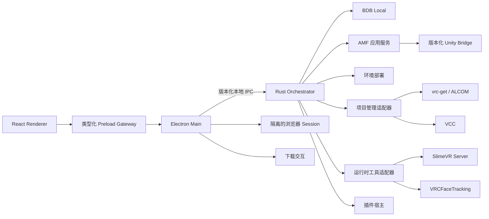

# VUA — VRC Ultra Assistant

VUA 是一套以 Windows 为首要平台、面向 VRChat 玩家的模块化桌面生产环境。它将素材浏览、
授权下载、本地内容管理、基于 Recipe 的 Avatar 装配、Unity 项目管理、环境部署、质量检测与
运行时工具集成组织成一条引导式工作流。

> **项目状态：** 全新建立的 pre-alpha 基线；目前没有公开发行版，也不提供兼容性承诺。

## 产品方向

VUA 从用户想要制作的 Avatar 出发。用户选择自己拥有的素材，并通过 Recipe 描述目标组合；
VUA 随后准备项目、解析受支持的依赖、通过 Unity Bridge 执行确定性装配、检查产物，并保存可
复查的 Build Record。

这种 Recipe-first 工作方式让用户先决定“想使用什么”，再由程序处理传统流程中的空项目创建、
导入顺序、绑定、菜单、优化与恢复步骤。

## 主要模块

### 桌面应用

桌面应用采用 Electron、React、TypeScript 与 Vite。Electron 负责窗口、隔离的网页视图、本地
Session 分区、下载交互与窄化的桌面 Gateway；Renderer 只承载展示和交互逻辑。

### Rust Orchestrator

Rust Orchestrator 是本地应用核心，负责持久任务状态、计划、批准、恢复、取消、适配器协调和
Build Record。它独立于 Renderer 运行，通过版本化本地 IPC 契约连接 Electron。

### BDB Local

BDB 不再是独立的云端后端或单独仓库，而是 VUA 的本地功能模块，负责：

- 内置 BOOTH 浏览界面；
- 用户授权范围内的下载与下载任务管理；
- 本地商品、子商品、文件、协议、别名和兼容关系元数据；
- 本地搜索，以及已购商品与 Warehouse 素材之间的映射；
- 对受支持的官方和社区内容管理工具提供适配器。

VUA 将建设自己的浏览器和内容管理器，同时在接口稳定、授权边界清楚的前提下支持 BOOTH
Library Manager 与 VRC Avatar Explorer。

### Avatar MegaFactory

AMF 将 Avatar 生产组织为六个面向用户的阶段：

1. **Warehouse（仓储）**：发现、预览、识别和整理本地素材；
2. **Recipe（配方）**：描述素材选择、组合意图、参数与操作；
3. **Assembly（装配）**：将通过验证的 Recipe 转换为确定性的 Unity Bridge 操作；
4. **Production（生产）**：执行计划、请求必要选择、报告进度并支持恢复；
5. **Inspection（检测）**：执行功能、性能、依赖、光照和上传准备度检查；
6. **Release（出厂）**：管理项目版本、Build Record、快照，并交接到 VRChat 官方 SDK 上传流程。

### 环境与项目管理

VUA 引导用户完成硬件与软件检测、VR 运行环境配置、Unity/VRChat 工具安装和项目准备。Unity
项目管理通过可检测能力的适配器，同时支持 [`vrc-get`/ALCOM](https://github.com/vrc-get) 与
VCC 官方工作流。

### 运行时集成

运行时工具采用两种并存的集成模式：

- **可选托管模式**：在上游许可证与分发规则允许时，由 VUA 安装、更新、启动和监控组件；
- **外部连接模式**：检测独立安装的实例，或通过公开接口与其连接。

计划集成的项目包括：

- [SlimeVR Server](https://github.com/SlimeVR/SlimeVR-Server)：提供全身追踪部署与运行状态集成；
- [VRCFaceTracking](https://github.com/benaclejames/VRCFaceTracking)：提供面部追踪部署与运行时
  集成。其源码仍在 GitHub 公开维护，正式发行渠道由上游项目另行提供。

每个组件是否随 VUA 分发，都需要单独完成许可证、再分发条款、更新机制与签名审查。

### 桌面与 VR Overlay

Overlay 通过稳定的应用服务展示引导、任务状态和运行时工具信息。它只承担交互与可视化，不复制
Orchestrator、AMF 或运行时适配器中的业务逻辑。

### 插件接口

VUA 将提供版本化的第三方插件协议。插件声明所需能力，通过稳定的应用服务进行交互，不依赖
私有数据库表、React 状态或内部 Rust 类型。首版标准将覆盖身份、兼容性协商、生命周期、命令、
查询、事件、长任务、取消、权限、诊断和弃用规则。

## 架构概览



远程网页不能访问 Node.js、Preload Gateway、Rust IPC、本地文件、凭据或插件。浏览会话和已购
文件保留在用户设备上，并使用用户自己的授权。

## 计划中的仓库结构

```text
VUA/
├─ apps/desktop/             Electron Main、Preload 与 React Renderer
├─ crates/orchestrator/      Rust 应用核心与任务运行时
├─ crates/bdb-local/         本地目录与内容元数据
├─ crates/acquisition/       浏览/下载应用端口与适配器
├─ crates/project-manager/   vrc-get/ALCOM 与 VCC 适配器
├─ crates/plugin-host/       插件生命周期与能力约束
├─ crates/overlay/           桌面与 VR Overlay 应用服务
├─ packages/contracts/       生成的前端契约
├─ packages/design-system/   UI Token 与复用组件
├─ schemas/                  Recipe、Bridge、插件与持久化 Schema
├─ unity/                    Unity 2022 Editor Package 与 Bridge
└─ docs/                     产品、架构、协议、ADR 与计划
```

这是一份目标边界说明，不代表其中的模块已经完成实现。

## 安全与分发边界

- VUA 不绕过购买、付费、身份、年龄或访问控制；
- 用户会话、订单信息、下载文件与付费素材只保存在本机；
- 仓库测试不使用真实付费素材和生产账号数据；
- 远程网页不能获得 Node.js 或 VUA 特权接口；
- 第三方组件的可选内置必须先完成许可证与再分发审查；
- 初始阶段不建设托管式插件市场。

## 参与开发

项目正在从全新基线重新建设。修改架构、契约、集成方式或仓库结构前，请先阅读
[AGENTS.md](AGENTS.md)。早期贡献优先采用带可执行测试的小型纵向切片，避免只增加大范围空壳。

仓库许可证和公开贡献政策将在首次公开发行前确定。
